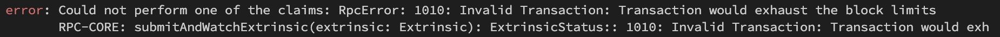

[](https://circleci.com/gh/w3f/polkadot-k8s-payouts)

# Polkadot-K8s-Payouts

Tool that automatically claims your Kusama/Polkadot validator rewards.  
Deployable in a Kubernetes cluster as a cronjob (helm chart).  
Forked from https://github.com/ironoa/polkadot-k8s-payouts


# How it works - Local

You can start by cloning the repo and installiing the dependencies, NodeJS and Yarn are required:
```
$ git clone https://github.com/w3f/polkadot-k8s-payouts
$ cd polkadot-k8s-payouts
$ yarn
```
Then you should create a configuration file, you can start by copying a sample provided with the repo and customizing it:
```
$ cp config/main.sample.yaml config/main.yaml
```
Now you can customize `config/main.yaml`, see the following configurations about how to do it. Once you are done you
can run the tool with:
```
$ yarn start
```

# About - Keystore file

You can generate the keystore file by exporting your account either from the [polkadot.js.org app](https://polkadot.js.org/apps/#/accounts)(Create a backup file) or from the [polkadot{.js} extension](https://polkadot.js.org/extension/)(Export Account)

# About - Keystore Password File

The password file should not contain any trailing new line charaters, therefore you could use this command to be sure to create a properly formatted password file: `echo -n "yourPassword" > yourFileName`

# About - Batch Size

The claims extrinsics are batched in utility.batch extrinsic calls. This parameter is the maximum number of calls to be packed into the batch extrinsic.  
ATTENTION: if you increase too much this value you might incur in this extrinsic error: 

# Optional - Grace Period
This is an optional parameter you can add to configure a grace period limitation you wish to introduce: it will prevent a claim to be triggered if the validator rewards is not "old" enough eras from the current one.  
For example, in Kusama this is equivalent to a grace period of 4 days:  
```
# config/main.yaml
logLevel: info
wsEndpoint: "wss://kusama-rpc.polkadot.io/"
gracePeriod:
  enabled: true
  eras: 16
claims:
  enabled: true
  claimerKeystore:
    filePath: /path/to/validator-000/keystore
    passwordPath: /path/to/validator-000/keystore/password
targets:
- alias: validator-000
validatorAddress: "<validator-000-stash-address>"
- alias: validator-001
validatorAddress: "<validator-001-stash-address>"  
```

# Optional - Deep Check
This is an optional parameter you can add to force a scan starting from the last 84 era, rather then relying on the onchain account ledger information. Keep it disabled for normal operations.


# Optional - Validators from Git

The list of target addresses can be dynamically retrieved (app startup/restart) from a Git file. Check the [GitConfigLoader](src/gitConfigLoader) implementation.  

- [GitLab API](https://docs.gitlab.com/ee/api/repository_files.html)